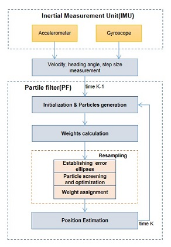

# Source code 

•	ellipsefig – Draws the error ellipse
•	fun_generate_points – Generates random walk trajectories
•	fun_pic – Draws the motion trajectory diagram
•	fun_pr_trail – Generates particles
•	fun_resample – Resamples based on the distance using the error ellipse
•	test – Generates an error ellipse diagram
•	trail – Particle tracking
•	RepeatTest – Repeats the experiment
•	SystematicResampling – Systematic resampling (comparison algorithm)
•	traditionalStratifiedResampling – Stratified resampling (comparison algorithm)
•	std-PF – Standard Particle Filter

# Methods

 The IMU consists of the accelerometer and the gyroscope, both of them will obtain the measurement at each moment. These values are used to the initial input for PF. The PF includes the following steps: 1) particle generation; 2) weight calculation; 3) resampling; 4) update estimation. In the process of resampling, the error ellipses are set to complete the screening and optimization . Particle filtering is a sequential process of state estimation.