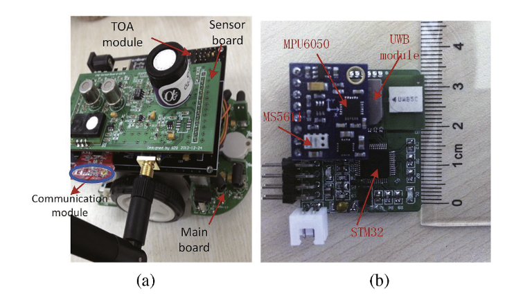

# Swarm-computing
Implementation of a distance-constrained group collaborative tracking method, including examples of the error ellipse-based particle filter method and the unscented Kalman filter method.

 ## Repository 
 This repository primarily provides the paper and related code for the research on spatiotemporal-constrained particle filter-based collaborative tracking algorithms for groups. It also includes our data on near-ground wireless signal measurements, as well as a dataset of wireless signal CSI matrices measured with WiFi devices under different driver action modes.

## Source code  and Datasets

1. EER-RF：Spatial-Temporal Constrained Particle Filter forCooperative Target Tracking

@article{Xu2021SpatialtemporalCP,
  title={Spatial-temporal constrained particle filter for cooperative target tracking},
  author={Cheng Xu and Xinxin Wang and Shihong Duan and Jiawang Wan},
  journal={J. Netw. Comput. Appl.},
  year={2021},
  volume={176},
  pages={102913},
  url={https://api.semanticscholar.org/CorpusID:230530453}
}
2. wireless-data
Our studies on wireless-data aim to advance wireless signal applications, with one focusing on robot communication in challenging terrains and the other on enhancing driver assistance systems through real-time action recognition.

The first study measures near-ground Ultra-Wideband (UWB) signals, proposing a two-segment radio channel model to enhance communication among mobile robots in GPS-denied environments. By analyzing different antenna heights and surface types, the research provides insights into optimizing signal path loss and connectivity.

The second project involves in-car Wi-Fi signal measurement to implement driver action recognition. Using Wi-Fi Channel State Information (CSI), the WiDriver system accurately identifies driving actions through a neural network and continuous activity classification, achieving high accuracy in posture and maneuver detection.