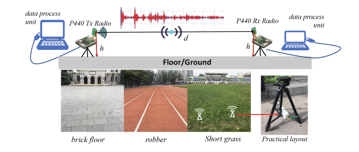
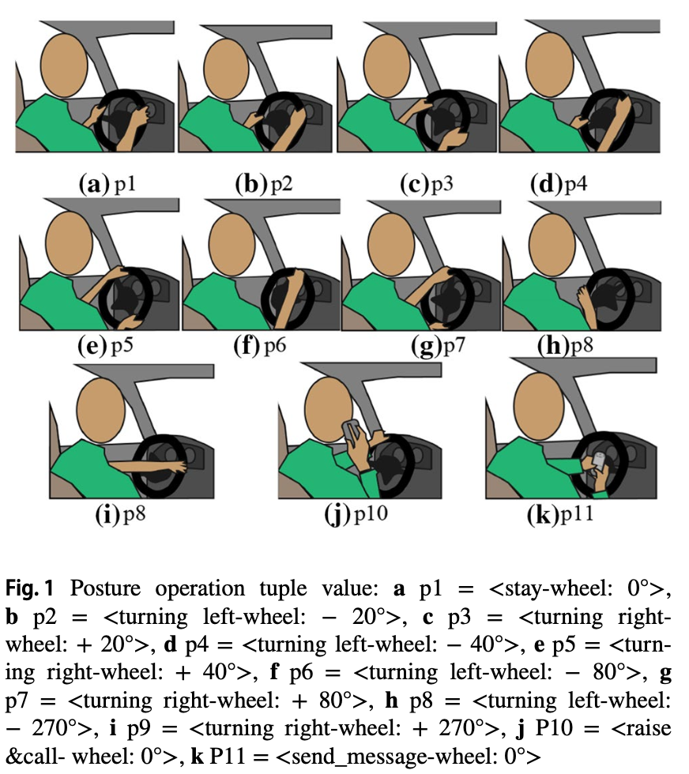
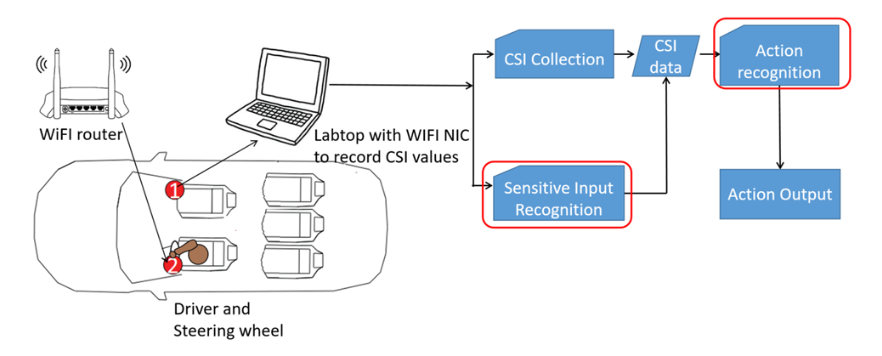

# Wireless signal measurement datasets
This GitHub repository focuses on measuring wireless signals, including near-ground signals and widely-used Wi-Fi signals in urban applications. It provides raw collected datasets and processing code.

## near-ground UWB signal
Ultra-Wideband (UWB) technology has great potential for the cooperation and navigation among near ground mobile robots in GPS-denied environments. In this paper, an efficient two-segment UWB radio channel model is proposed with considering the multi-path condition in very near-ground environments and different surface roughness. We conducted field measurements to collect channel information, with both transmitter and receiver antennas placed at different heights above the ground: 0cm-20cm. Signal frequency was chosen at 4.3GHz with bandwidth of 1GHz. Three ground coverings were tested in common scenarios: brick, grass and robber fields. The proposed model has enhanced accuracy achieved by careful assessment of dominant propagation mechanisms in each segment, such as diffraction loss due to obstruction of the first Fresnel zone and higher-order waves produced by ground roughness. It is realized that antenna height and distance are the most influential geometric parameters to affect the path loss model. Once the antenna height is known, there exists a breakpoint distance in UWB propagation, which separates two segmentation using the different path-loss mechanism. Different surface types can cause different signal attenuation. Monte Carlo simulations are used to investigate the effects of antenna height, distance, ground surface type on mobile robots swarm communication to find out the antenna height is also a dominant factor on connectivity and the average number of neighbors. Within a certain range, the higher the antenna height and the closer the communication distance, the better the communication performance will usually be. Cramér-Rao lower bound(CRLB) of path loss estimator based on the proposed model is derived to show the relationship between CRLB with height and distance.

The measurement platform for near-ground UWB signals is as follows:

The complete measurement data can be found on the cloud drive：

@article{Duan2020UltraWidebandRC,
  title={Ultra-Wideband Radio Channel Characteristics for Near-Ground Swarm Robots Communication},
  author={Shihong Duan and Ran Su and Cheng Xu and Yulin Chen and Jie He},
  journal={IEEE Transactions on Wireless Communications},
  year={2020},
  volume={19},
  pages={4715-4726},
  url={https://api.semanticscholar.org/CorpusID:218786328}
}

## In-car Wi-Fi Signal Measurement: Implementing Driver Action Recognition

Important to support the driver assistant system application. The possibility of using device-free sensing technology for driver activity recognition in a simulated driving environment is investigated in this paper. We present WiDriver, among the first efforts to employ channel state information (CSI) amplitude variation data to intelligently estimate driving actions with commodity WiFi devices. The WiDriver proposes the scheme of screening sensitive input data from original CSI matrix of WiFi signals based on BP neural network algorithm; and the continuous driving activities classification algorithm by introducing the posture sequence, driving context finite automate model. Our experimental driving study in carriage with 5 subjects shows that the sensitive input selection scheme can achieve high accuracy of 96.8% in posture recognition and the continuous action classification algorithm can reach 90.76% maneuver operation detection rate.

@article{Duan2018WiDriverDA,
  title={WiDriver: Driver Activity Recognition System Based on WiFi CSI},
  author={Shihong Duan and Tianqing Yu and Jie He},
  journal={International Journal of Wireless Information Networks},
  year={2018},
  volume={25},
  pages={146 - 156},
  url={https://api.semanticscholar.org/CorpusID:13991618}
}